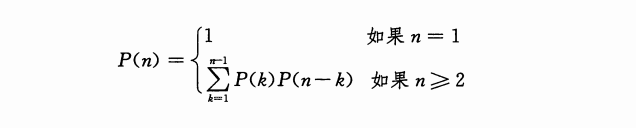
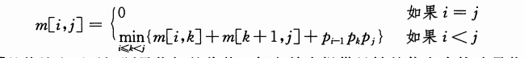

## 矩阵链乘法

### 问题描述
矩阵链乘法问题可描述如下：给定`n`个矩阵的链`(A1,A2,...,An)`,矩阵Ai的规模为`p(i-1)*pi (1<=i<=n)`,求完全括号化方案，使得计算乘积`A1，A2,...An`所需标量乘法次数最少

注意，求解矩阵乘法问题并不是要真正进行矩阵相乘运算，我们的目标只是确定代价最低的计算顺序。确定最优计算顺序所花费的时间通常要比随后真正进行矩阵相乘所节省的时间要少。

### 计算括号化方案的数量

对一个n个矩阵的链，令P(n)表示，可供选择的括号化方案的数量。

当`n=1`时，由于只有一个矩阵，因此只有一种完全括号化方案。
当`n>=2`时，完全括号化的矩阵乘积可描述为两个完全括号化的部分积相乘的形式，而两个部分积的划分点在第`k`个矩阵和第`k+1`个矩阵之间，k为1,2,...,n-1中的任意一个值。因此，我们可以得到如下递归公式：


### 应用动态规划法

下面用动态规划法来求解矩阵链的最优括号化方案，我们还是按照本章开头提出的四个步骤进行：

1. 刻画一个最优解的结构特征。
2. 递归地定义最优解的值。
3. 计算最优解的值，通常采用自底向上的方法。
4. 利用计算出的信息构造一个最优解。

#### 步骤1：最优括号化方案的结构特征

对某个整数k，我们首先计算矩阵A(i..k)和A(k+1..j)，然后再计算他们的乘积得到最终结果A(i..j)。

此方案的计算代价等于矩阵A(i..k)的计算代价，加上矩阵(k+1..j)的计算代价，再加上两者相乘的计算代价。

#### 步骤2：一个递归求解方案

下面用子问题的最优解来递归地定义原问题最优解的代价。

对于矩阵乘法问题，我们可以将对所有`1<=i<=j<=n`确定`AiA(i+1)...Aj`的最小代价括号化方案作为子问题。

令`m[i ,j]`表示计算矩阵`Ai..j`所需标量乘法次数的最小值，那么，原问题的最优解——计算`A1..n`所需的最低代价就是`m[1,n]`。

我们假设`AiA(i+1)...Aj`的最优括号化方案的分割点在矩阵`Ak`和`A(k+1)`之间，其中`i<=k<j`。那么，`m[i,j]`就等于计算`Ai..k`和`A(k+1)..j`的代价加上两者相乘的代价的最小值。**由于矩阵Ai的大小为`p(i-1) *pi`，易知Ai..k与A(k+1)...j相乘的代价为p(i-1)pkpj次标量乘法运算。**

因此，我们得到
```
m[i,j] = m[i,k] + m[k+1,j] + p(i-1)pkpj
```


公式15.7

#### 步骤3：计算最优代价

注意到，我们需要求解的不同子问题的数目是相对较少的：每对满足`1<=i<=j<=n`的i和j对应一个唯一的子问题，

共有


**递归算法会在递归调用树的不同分支中多次遇到同一个子问题。这种子问题重叠的性质是应用动态规划的另一个标识(第一个标识是最优子结构)**

我们采用自底向上的表格法代替基于公式15.7的递归算法来计算最优代价。

下面给出的过程MATRIX-CHAIN-ORDER实现了自底向上的表格法。

此过程假定矩阵`Ai`的规模为`p(i-1)*pi(i=1,2,...,n)`。它的输入是一个序列`p=(p0,p1,...,pn)`，其长度为`p.length = n + 1`。过程用一个辅助表`m[1..n, 1..n]`来保存代价`m[i,j]`，用另一个辅助表`s[1..n-1,2..n]`记录最优值`m[i,j]` 对应的分割点`k`。我们就可以利用表`s`构造最优解。

为了实现自底向上法，我们必须确定计算`m[i,j]`时需要访问哪些其他表项。

公式(15.7)显示，`j-i+1`个矩阵链相乘的最优计算代价`m[i,j]`只依赖于哪些少于`j-i+1`个矩阵链相乘的最优计算代价。

**下面这段不是特别懂**

也就是说，对`k=i,i+1,...,j-1`，矩阵`Ai...k`是`k-i+1<j-i+1`个矩阵的积，矩阵`A(k+1)..j`是`j-k<j-i+1`个矩阵的积。因此，算法应该按长度递增的顺序求解矩阵链括号化问题，并按对应的顺序填写表`m`。
对矩阵`AiAi+1...Aj`最优括号化子问题，我们认为其规模为链的长度`j-i+1`

```
MATRIX-CHAIN-ORDER(p)
1  n = p.length - 1
2  let m[1..n,1..n] and s[1..n-1,2..n] be new tables
3  for i = 1 to n
4    m[i , i] = 0 // 计算所有i = 1 ~ n 的代价
5  for l = 2 to n // 链的长度
6   for i = 1 to n - l + 1  // 计算链长度为l的最小代价 即计算 m[i , i+l] 的最小代价
7     j = i + l - 1 // i 到 j 的长度为 l
8     m[i , j] = INF
9     for k = i to j - 1
10      q = m[i , k] + m[k + 1, j] + p(i - 1)pkpj // 计算在i,j内以k为分割点时的最小代价
11      if q < m[i , j]
12        m[i , j] = q // 最优分割代价
13        s[i , j] = k // 最优分割点
14
15  return m and s
```

算法首先在3~4行对所有`i=1,2,...,n`计算`m[i, i]=0`(长度为1的链的最小计算代价)。

接着在第5~13行for循环

第一个循环步中，利用递归公式(15.7)对所有`i=1,2,...,n-1` 计算`m[i , i + 1]` (长度 `l = 2`的链的最小计算代价)。

第二个循环步中，算法对所有`i = 1, 2 , ..., n-2` 计算`m[i, i + 2]`(长度 `l = 3`的链的最小计算代价)，依此类推。

在每个循环步中，地 10~13行计算代价`m[i , j]`时仅依赖于已经计算出的表项`m[i , k]`和`m[k + 1, j]`。


#### 步骤4:构造最优解
```
PRINT-OPTIMAL-PARENS(s,i,j)
if i == j
  print "A"i
else
  print "("
  PRINT-OPTIMAL-PARENS(s,i,s[i , j])
  PRINT-OPTIMAL-PARENS(s,s[i, j] + 1,j)
  print ")"
```
