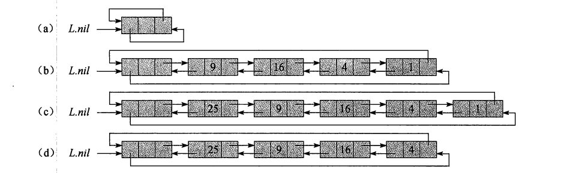

## 链表

双向链表L的每个元素都是一个对象,每个对象有一个关键字key和两个指针:next和prev.对象中还可以包含其他的辅助数据.

### 链表的线性搜索

```
LIST-SEARCH(L,k)

x = L.head

while x!= nil and x.key != k
  x = x.next

return x
```

### 链表的插入

```
LIST-INSERT(L,x)
x.next = L.head

if L.head != nil
  L.head.prev = x

L.head = x
x.prev = NIL
```

### 链表的删除

```
LIST-DELETE(L,x)

if x.prev != NIL
  x.prev.next = x.next
else
  L.head = x.next

if x.next != NIL
  x.next.prev = x.prev
```

### 哨兵

哨兵是一个哑对象,其作用是简化边界条件处理.

例如,假设链表L中设置一个对象L.nil,该对象代表NIL,但也具有其他对象相同的各个属性.

对于链表代码中出现的每一处对NIL的引用,都代之以对哨兵L.nil的引用.

如图所示,这样的调整将一个常规的双向链表转变为一个有哨兵的双向链表,哨兵L.nil位于表头和表尾之间.
属性L.nil.next 指向表头,L.nil.prev指向表尾.类似地,表尾的next属性和表头的prev属性同时指向L.nil.因为 L.nil.next指向表头,我们就可以去掉属性L.head,并把对它的引用代替为对L.nil.next的引用.一个空的链表只由一个哨兵组成,L.nil.next和L.nil.prev同时指向L.nil



```
LIST-SEARCH(L,k)

x = L.nil.next
while x != L.nil and x.key != k
  x = x.next

return x
```

```
LIST-INSERT(L,x)

x.next = L.nil.next // x.next指向头元素
L.nil.next.prev  = x // 头元素prev指向x
L.nil.next = x // 向头结点插入,头是x
x.prev = L.nil // 头结点的prev指向L.nil

```
