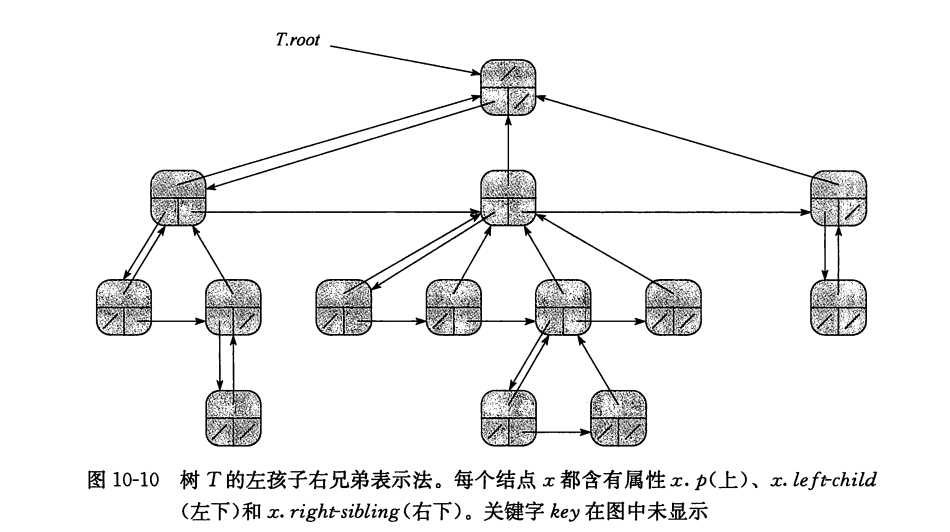

## 有根树的表示

### 二叉树

### 分支无限制的有根数

#### 左孩子右兄弟表示法.

和前述方法类似,每个结点包含一个父节点的指针p,且T.root指向树T的根结点.然而,每个结点中不是包含指向每个孩子的指针,而是只有两个指针:

1. x.left-child指向结点x最左边的孩子结点.
2. x.right-sibling指向x右侧相邻的兄弟结点.

如果结点x没有孩子结点,则x.left-child=nil,如果结点x是其父节点的最右孩子,则x.right-sibliing=nil

### 树的其他表示方法

例如在第六章中,我们对一棵完全二叉树使用堆来表示,堆用一个单数组加上堆的最末结点的下标表示
