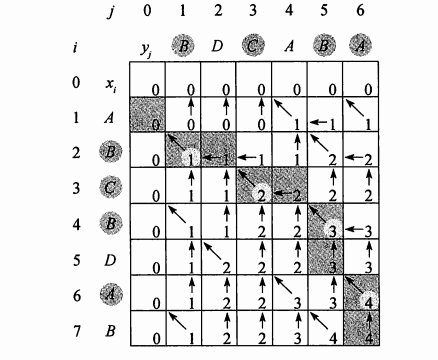

## 最长公共子序列

我们用英文单词首字母表示4种碱基，这样就可以将一个DNA串表示为有限集{A, C, T, G}上的一个字符串。

我们比较两个DNA串的一个原因是希望确定他们的“相似度”，作为度量两种生物相近程度的指标。

我们还可以这样来定义相似性：如果一个串转换为另一个串所需的操作很少，那么可以说两个串是相似的。

我们将最后一种相似度的概念命名为最长公共子序列问题。一个给定序列的子序列，就是将给定序列中零个或多个元素去掉之后得到的结果。

其形式化定义如下：
给定一个序列X={x1,x2,...,xm}，
给另一个序列Z={z1,z2,...,zk}，
满足如下条件时称为X的子序列,即存在一个严格递增的X的下标序列<i1,i2,...,ik>,对所有j=1,2,...,k,满足xij=zj。

给定两个序列X和Y，如果Z既是X的子序列，也是Y的子序列，我们称它是X和Y的公共子序列。

例如，

最长公共子序列问题：
给定两个序列X=<x1,x2,...,xm>和Y=<y1,y2,...,yn>，求X和Y长度最长的公共子序列。

### 步骤1: 刻画最长公共子序列的特征。

，因此暴力方法的运行时间为指数阶，对较长的序列是不实用的。

但是，如下面的定理所示，LCS问题具有最优子结构性质。

我们将看到，子问题的自然分类对应两个输入序列的“前缀”对。前缀的严谨定义如下：给定一个序列 X={x1,x2,...,xm},对 i=0,1,...,m,定义X的第i前缀为Xi=<x1,x2,...,xi>。例如，

定理15.1：
令X=<x1,x2,...,xm>和Y=<y1,y2,...,yn>为两个序列，Z=<z1,z2,...,zk>为X和Y的任意LCS。

1. 如果xm = yn,则zk = xm = yn 且Z(k - 1)是X(m - 1)和Y(n - 1)的一个LCS
2. 如果xm != yn,那么zk != xm 意味着Z是X(m-1)和Y的一个LCS
3. 如果xm != yn,那么zk != yn 意味着Z是X和Y(n-1)的一个LCS

### 步骤2: 一个递归解

定理15.1意味着，在求X=<x1,x2,...,xm>和Y=<y1,y2,...,yn>的一个LCS时，我们需要求解一个或两个子问题。

如果xm = yn，我们应该求解X(m-1)和Y(n-1)的一个LCS。将xm=yn 追加到这个LCS的末尾，就得到X和Y的一个LCS。

如果xm != yn，我们应该求解两个子问题：

求X(m-1)和Y的一个LCS与X和Y(n-1)的一个LCS。两个LCS较长者即为X和Y的一个LCS。


### 步骤3: 计算LCS的长度
过程LCS-LENGTH接受两个子序列X=<x1,x2,...,xm>和Y=<y1,y2,...,yn>为输入。

它将c[i, j]的值保存在表c[0..m, 0..n]中，并按 **行主次序** 计算表项。

> 行主次序 :首先由左至右计算c的第一行，然后计算第二行，依次类推。
```
LCS-LENGTH(X,Y)
m = X.length
n = Y.length
let b[1..m,1..n] and c[0..m,0..n]be new tables.
for i = 1 to m
  c[i,0] = 0
for j = 0 to n
  c[0,j] = 0
for i = 1 to m
  for j = 1 to n
    if xi == xj
      c[i, j] = c[i - 1, j - 1] + 1
      b[i , j] = "↖"
    else if c[i - 1, j] >= c[i, j - 1]
      c[i , j] = c[i - 1, j]
      b[i , j] = "↑"
    else c[i , j] = c[i, j-1]
      b[i, j] = "←"
return c and b
```



### 步骤4: 构造LCS

```
PRINT-LCS
```

### 算法改进

一旦设计出一个算法，通常情况下你都会发现它在时空开销上有改进的余地。一些改进可以简化代码，将性能提高常数倍，**但除此之外不会产生性能反面的渐进性提升。** 另一些改进可以带来时空上巨大的渐进性提升。
