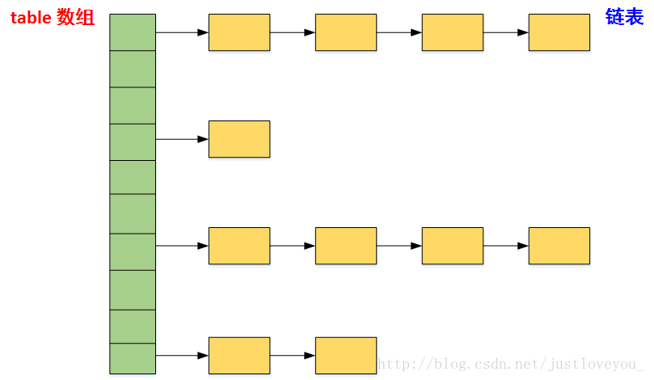
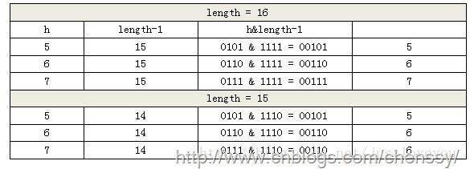
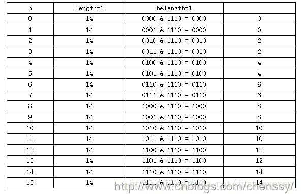

>  https://blog.csdn.net/justloveyou_/article/details/62893086

# 彻头彻尾理解 HashMap

#### 摘要：

HashMap是Map族中最为常用的一种，也是 Java Collection Framework 的重要成员。本文首先给出了 HashMap 的实质并概述了其与 Map、HashSet 的关系，紧接着给出了 HashMap 在 JDK 中的定义，并结合源码分析了其四种构造方式。最后，通过对 HashMap 的数据结构、实现原理、源码实现三个方面的剖析，深入到它底层 Hash 存储机制，解释了其底层数组长度总是 2 的 n 次方的原因，也揭示了其快速存取、扩容及扩容后的重哈希的原理与实现。

#### 友情提示：

本文所有关于HashMap的源码都是基于 JDK 1.6 的，不同 JDK 版本之间也许会有些许差异，但不影响我们对 HashMap 的数据结构、原理等整体的把握和了解。

HashMap 的直接子类LinkedHashMap继承了HashMap的所用特性，并且还通过额外维护一个双向链表保持了有序性, 通过对比LinkedHashMap和HashMap的实现有助于更好的理解HashMap。

------

## 一.HashMap 概述

Map 是 Key-Value 对映射的抽象接口，该映射不包括重复的键，即一个键对应一个值。HashMap 是 Java Collection Framework 的重要成员，也是Map族(如下图所示)中我们最为常用的一种。简单地说，HashMap 是基于哈希表的 Map 接口的实现，以 Key-Value 的形式存在，即存储的对象是 Entry (同时包含了 Key 和 Value) 。在HashMap中，其会根据hash算法来计算key-value的存储位置并进行快速存取。**特别地，HashMap最多只允许一条Entry的键为Null(多条会覆盖)，但允许多条Entry的值为Null**。此外，HashMap 是 Map 的一个**非同步**的实现。


　　同样地，HashSet 也是 Java Collection Framework 的重要成员，是 Set 接口的常用实现类，但其与 HashMap 有很多相似之处。对于 HashSet 而言，其采用 Hash 算法决定元素在Set中的存储位置，这样可以保证元素的快速存取；对于 HashMap 而言，其将 key-value 当成一个整体(Entry 对象)来处理，其也采用同样的 Hash 算法去决定 key-value 的存储位置从而保证键值对的快速存取。虽然 HashMap 和 HashSet 实现的接口规范不同，但是它们底层的 Hash 存储机制完全相同。实际上，HashSet 本身就是在 HashMap 的基础上实现的。因此，通过对 HashMap 的数据结构、实现原理、源码实现三个方面了解，我们不但可以进一步掌握其底层的 Hash 存储机制，也有助于对 HashSet 的了解。

　　必须指出的是，虽然容器号称存储的是 Java 对象，但实际上并不会真正将 Java 对象放入容器中，只是在容器中保留这些对象的引用。也就是说，Java 容器实际上包含的是引用变量，而这些引用变量指向了我们要实际保存的 Java 对象。

------

## 二. HashMap 在 JDK 中的定义

　　HashMap实现了Map接口，并继承 AbstractMap 抽象类，其中 Map 接口定义了键值映射规则。和 AbstractCollection抽象类在 Collection 族的作用类似， AbstractMap 抽象类提供了 Map 接口的骨干实现，以最大限度地减少实现Map接口所需的工作。HashMap 在JDK中的定义为：

```Java
public class HashMap<K,V>
    extends AbstractMap<K,V>
    implements Map<K,V>, Cloneable, Serializable{
...
}
```

----------------

## 三. HashMap 的构造函数

HashMap 一共提供了四个构造函数，其中 默认无参的构造函数 和 参数为Map的构造函数 为 Java Collection Framework 规范的推荐实现，其余两个构造函数则是 HashMap 专门提供的。

------

### 1、HashMap()

该构造函数意在构造一个具有> 默认初始容量 (16) 和 默认负载因子(0.75) 的空 HashMap，是 Java Collection Framework 规范推荐提供的，其源码如下：

```java
     /**
     * Constructs an empty HashMap with the default initial capacity
     * (16) and the default load factor (0.75).
     */
    public HashMap() {

        // 负载因子:用于衡量的是一个散列表的空间的使用程度
        this.loadFactor = DEFAULT_LOAD_FACTOR;

        // HashMap进行扩容的阈值，它的值等于 HashMap 的容量乘以负载因子
        threshold = (int)(DEFAULT_INITIAL_CAPACITY * DEFAULT_LOAD_FACTOR);

        // HashMap的底层实现仍是数组，只是数组的每一项都是一条链
        table = new Entry[DEFAULT_INITIAL_CAPACITY];

        init();
    }
```

### 2、HashMap(int initialCapacity, float loadFactor)

该构造函数意在构造一个 指定初始容量 和 指定负载因子的空 HashMap，其源码如下：

```java
    /**
     * Constructs an empty HashMap with the specified initial capacity and load factor.
     */
    public HashMap(int initialCapacity, float loadFactor) {
        // 初始容量不能小于 0
        if (initialCapacity < 0)
            throw new IllegalArgumentException("Illegal initial capacity: " + initialCapacity);

        // 初始容量不能超过 2^30
        if (initialCapacity > MAXIMUM_CAPACITY)
            initialCapacity = MAXIMUM_CAPACITY;

        // 负载因子不能小于 0            
        if (loadFactor <= 0 || Float.isNaN(loadFactor))
            throw new IllegalArgumentException("Illegal load factor: " +
                                               loadFactor);

        // HashMap 的容量必须是2的幂次方，超过 initialCapacity 的最小 2^n
        int capacity = 1;
        while (capacity < initialCapacity)
            capacity <<= 1;   

        // 负载因子
        this.loadFactor = loadFactor;

        // 设置HashMap的容量极限，当HashMap的容量达到该极限时就会进行自动扩容操作
        threshold = (int)(capacity * loadFactor);

        // HashMap的底层实现仍是数组，只是数组的每一项都是一条链
        table = new Entry[capacity];
        init();
    }
```

-------

### 3、HashMap(int initialCapacity)

该构造函数意在构造一个指定初始容量和默认负载因子 (0.75)的空 HashMap，其源码如下：

```Java
    // Constructs an empty HashMap with the specified initial capacity and the default load factor (0.75)
    public HashMap(int initialCapacity) {
        this(initialCapacity, DEFAULT_LOAD_FACTOR);  // 直接调用上述构造函数
    }
```

------

### 4、HashMap(Map<? extends K, ? extends V> m)

该构造函数意在构造一个与指定 Map 具有相同映射的 HashMap，其 初始容量不小于 16 (具体依赖于指定Map的大小)，负载因子是 0.75，是 Java Collection Framework 规范推荐提供的，其源码如下：

```Java
    // Constructs a new HashMap with the same mappings as the specified Map.
    // The HashMap is created with default load factor (0.75) and an initial capacity
    // sufficient to hold the mappings in the specified Map.
    public HashMap(Map<? extends K, ? extends V> m) {

        // 初始容量不小于 16
        this(Math.max((int) (m.size() / DEFAULT_LOAD_FACTOR) + 1,
                      DEFAULT_INITIAL_CAPACITY), DEFAULT_LOAD_FACTOR);
        putAllForCreate(m);
    }
```

-------------

在这里，我们提到了两个非常重要的参数：**初始容量** 和 **负载因子**，这两个参数是影响HashMap性能的重要参数。其中，容量表示哈希表中桶的数量 (table 数组的大小)，**初始容量是创建哈希表时桶的数量；负载因子是哈希表在其容量自动增加之前可以达到多满的一种尺度，它衡量的是一个散列表的空间的使用程度，负载因子越大表示散列表的装填程度越高，反之愈小。**

对于使用**拉链法** (下文会提到）的哈希表来说，查找一个元素的平均时间是 O(1+a)，a 指的是链的长度，是一个常数。特别地，若负载因子越大，那么对空间的利用更充分，但查找效率的也就越低；若负载因子越小，那么哈希表的数据将越稀疏，对空间造成的浪费也就越严重。**系统默认负载因子为 0.75，这是时间和空间成本上一种折衷，一般情况下我们是无需修改的。**

------


## 四. HashMap 的数据结构

### 1、哈希的相关概念

Hash 就是把任意长度的输入(又叫做预映射， pre-image)，通过哈希算法，变换成固定长度的输出(通常是整型)，该输出就是哈希值。这种转换是一种**压缩映射**，也就是说，散列值的空间通常远小于输入的空间。不同的输入可能会散列成相同的输出，从而不可能从散列值来唯一的确定输入值。简单的说，就是一种将任意长度的消息压缩到某一固定长度的息摘要函数。

### 2、哈希的应用：数据结构

我们知道，**数组的特点是：寻址容易，插入和删除困难；而链表的特点是：寻址困难，插入和删除容易。** 那么我们能不能综合两者的特性，做出一种寻址容易，插入和删除也容易的数据结构呢？答案是肯定的，这就是我们要提起的哈希表。事实上，哈希表有多种不同的实现方法，我们接下来解释的是最经典的一种方法 —— 拉链法，我们可以将其理解为链表的数组，如下图所示：


我们可以从上图看到，左边很明显是个数组，数组的每个成员是一个链表。该数据结构所容纳的所有元素均包含一个指针，用于元素间的链接。我们根据元素的自身特征把元素分配到不同的链表中去，反过来我们也正是通过这些特征找到正确的链表，再从链表中找出正确的元素。其中，根据元素特征计算元素数组下标的方法就是 哈希算法。

总的来说，哈希表适合用作快速查找、删除的基本数据结构，通常需要总数据量可以放入内存。在使用哈希表时，有以下几个关键点：

- hash 函数（哈希算法）的选择：针对不同的对象(字符串、整数等)具体的哈希方法；

- 碰撞处理：常用的有两种方式，
  - 一种是open hashing，即 拉链法；
  - 另一种就是 closed hashing，即开地址法(opened addressing)。

### 3、HashMap 的数据结构

我们知道，在Java中最常用的两种结构是 数组 和 链表，几乎所有的数据结构都可以利用这两种来组合实现，HashMap 就是这种应用的一个典型。实际上，HashMap 就是一个 链表数组，如下是它数据结构：



从上图中，我们可以形象地看出HashMap底层实现还是数组，只是数组的每一项都是一条链。其中参数initialCapacity 就代表了该数组的长度，也就是桶的个数。在第三节我们已经了解了HashMap 的默认构造函数的源码：

```java
 /**
     * Constructs an empty HashMap with the default initial capacity
     * (16) and the default load factor (0.75).
     */
    public HashMap() {

        // 负载因子:用于衡量的是一个散列表的空间的使用程度
        this.loadFactor = DEFAULT_LOAD_FACTOR;

        // HashMap进行扩容的阈值，它的值等于 HashMap 的容量乘以负载因子
        threshold = (int)(DEFAULT_INITIAL_CAPACITY * DEFAULT_LOAD_FACTOR);

        // HashMap的底层实现仍是数组，只是数组的每一项都是一条链
        table = new Entry[DEFAULT_INITIAL_CAPACITY];

        init();
    }
```

从上述源码中我们可以看出，每次新建一个HashMap时，都会初始化一个Entry类型的table数组，其中 Entry类型的定义如下：

```java
static class Entry<K,V> implements Map.Entry<K,V> {

    final K key;     // 键值对的键
    V value;        // 键值对的值
    Entry<K,V> next;    // 下一个节点
    final int hash;     // hash(key.hashCode())方法的返回值

    /**
     * Creates new entry.
     */
    Entry(int h, K k, V v, Entry<K,V> n) {     // Entry 的构造函数
        value = v;
        next = n;
        key = k;
        hash = h;
    }

    ......

}
```

其中，Entry为HashMap的内部类，实现了 Map.Entry 接口，其包含了键key、值value、下一个节点next，以及hash值四个属性。事实上，Entry 是构成哈希表的基石，是哈希表所存储的元素的具体形式。

--------

## 五. HashMap 的快速存取

在HashMap中，我们最常用的两个操作就是：put(Key,Value) 和 get(Key)。我们都知道，HashMap中的Key是唯一的，那它是如何保证唯一性的呢？我们首先想到的是用equals比较，没错，这样可以实现，但随着元素的增多，put 和 get 的效率将越来越低，这里的时间复杂度是O(n)。也就是说，假如 HashMap 有1000个元素，那么 put时就需要比较 1000 次，这是相当耗时的，远达不到HashMap快速存取的目的。实际上，HashMap 很少会用到equals方法，因为其内通过一个哈希表管理所有元素，利用哈希算法可以快速的存取元素。当我们调用put方法存值时，HashMap首先会调用Key的hashCode方法，然后基于此获取Key哈希码，通过哈希码快速找到某个桶，这个位置可以被称之为 bucketIndex。通过《Java 中的 ==, equals 与 hashCode 的区别与联系》 所述hashCode的协定可以知道，如果两个对象的hashCode不同，那么equals一定为 false；否则，如果其hashCode相同，equals也不一定为 true。所以，理论上，hashCode 可能存在碰撞的情况，当碰撞发生时，这时会取出bucketIndex桶内已存储的元素，并通过hashCode() 和 equals() 来逐个比较以判断Key是否已存在。如果已存在，则使用新Value值替换旧Value值，并返回旧Value值；如果不存在，则存放新的键值对<Key, Value>到桶中。因此，在 HashMap中，equals() 方法只有在哈希码碰撞时才会被用到。

下面我们结合JDK源码看HashMap 的存取实现。

### 1、HashMap 的存储实现

HashMap 中，键值对的存储是通过 put(key,vlaue) 方法来实现的，其源码如下：

```Java
    /**
     * Associates the specified value with the specified key in this map.
     * If the map previously contained a mapping for the key, the old
     * value is replaced.
     *
     * @param key key with which the specified value is to be associated
     * @param value value to be associated with the specified key
     * @return the previous value associated with key, or null if there was no mapping for key.
     *  Note that a null return can also indicate that the map previously associated null with key.
     */
    public V put(K key, V value) {

        // 当key为null时，调用putForNullKey方法，并将该键值对保存到table的第一个位置
        if (key == null)
            return putForNullKey(value);

        // 根据key的hashCode计算hash值
        int hash = hash(key.hashCode());             //  ------- (1)

        // 计算该键值对在数组中的存储位置（哪个桶）
        int i = indexFor(hash, table.length);              // ------- (2)

        // 在table的第i个桶上进行迭代，寻找 key 保存的位置
        for (Entry<K,V> e = table[i]; e != null; e = e.next) {      // ------- (3)
            Object k;
            // 判断该条链上是否存在hash值相同且key值相等的映射，若存在，则直接覆盖 value，并返回旧value
            if (e.hash == hash && ((k = e.key) == key || key.equals(k))) {
                V oldValue = e.value;
                e.value = value;
                e.recordAccess(this);
                return oldValue;    // 返回旧值
            }
        }

        modCount++; //修改次数增加1，快速失败机制

        //原HashMap中无该映射，将该添加至该链的链头
        addEntry(hash, key, value, i);            
        return null;
    }
```

通过上述源码我们可以清楚了解到HashMap保存数据的过程。首先，判断key是否为null，若为null，则直接调用putForNullKey方法；若不为空，则先计算key的hash值，然后根据hash值搜索在table数组中的索引位置，如果table数组在该位置处有元素，则查找是否存在相同的key，若存在则覆盖原来key的value，否则将该元素保存在链头（最先保存的元素放在链尾）。此外，若table在该处没有元素，则直接保存。这个过程看似比较简单，但其实有很多需要回味的地方，下面我们一一来看。

先看源码中的 (3) 处，此处迭代原因就是为了防止存在相同的key值。如果发现两个hash值（key）相同时，HashMap的处理方式是用新value替换旧value，这里并没有处理key，这正好解释了 HashMap 中没有两个相同的 key。

#### 1). 对NULL键的特别处理：putForNullKey()

我们直接看其源码：

```java
    /**
     * Offloaded version of put for null keys
     */
    private V putForNullKey(V value) {
        // 若key==null，则将其放入table的第一个桶，即 table[0]
        for (Entry<K,V> e = table[0]; e != null; e = e.next) {   
            if (e.key == null) {   // 若已经存在key为null的键，则替换其值，并返回旧值
                V oldValue = e.value;
                e.value = value;
                e.recordAccess(this);
                return oldValue;
            }
        }
        modCount++;        // 快速失败
        addEntry(0, null, value, 0);       // 否则，将其添加到 table[0] 的桶中
        return null;
    }
```

通过上述源码我们可以清楚知到，HashMap 中可以保存键为NULL的键值对，且该键值对是唯一的。若再次向其中添加键为NULL的键值对，将覆盖其原值。此外，如果HashMap中存在键为NULL的键值对，那么一定在第一个桶中。

#### 2). HashMap 中的哈希策略（算法）

在上述的 put(key,vlaue) 方法的源码中，我们标出了 HashMap 中的哈希策略（即(1)、(2)两处），**hash() 方法用于对Key的hashCode进行重新计算，而 indexFor() 方法用于生成这个Entry对象的插入位置。当计算出来的hash值与hashMap的(length-1)做了&运算后，会得到位于区间[0，length-1]的一个值。** 特别地，这个值分布的越均匀， HashMap 的空间利用率也就越高，存取效率也就越好。

我们首先看(1)处的 hash() 方法，该方法为一个纯粹的数学计算，用于进一步计算key的hash值，源码如下：

```java
    /**
     * Applies a supplemental hash function to a given hashCode, which
     * defends against poor quality hash functions.  This is critical
     * because HashMap uses power-of-two length hash tables, that
     * otherwise encounter collisions for hashCodes that do not differ
     * in lower bits.
     *
     * Note: Null keys always map to hash 0, thus index 0.
     */
    static int hash(int h) {
        // This function ensures that hashCodes that differ only by
        // constant multiples at each bit position have a bounded
        // number of collisions (approximately 8 at default load factor).
        h ^= (h >>> 20) ^ (h >>> 12);
        return h ^ (h >>> 7) ^ (h >>> 4);
    }
```

正如JDK官方对该方法的描述那样，使用hash()方法对一个对象的hashCode进行重新计算是为了防止质量低下的hashCode()函数实现。由于hashMap的支撑数组长度总是 2 的幂次，通过右移可以使低位的数据尽量的不同，从而使hash值的分布尽量均匀。更多关于该 hash(int h)方法的介绍请见《HashMap hash方法分析》，此不赘述。

通过上述hash()方法计算得到 Key 的 hash值 后，怎么才能保证元素均匀分布到table的每个桶中呢？我们会想到取模，但是由于取模的效率较低，HashMap 是通过调用(2)处的indexFor()方法处理的，其不但简单而且效率很高，对应源码如下所示：

```java
    /**
     * Returns index for hash code h.
     */
    static int indexFor(int h, int length) {
        return h & (length-1);  // 作用等价于取模运算，但这种方式效率更高
    }
```

我们知道，HashMap的底层数组长度总是2的n次方。**当length为2的n次方时，h&(length - 1)就相当于对length取模，而且速度比直接取模要快得多，这是HashMap在速度上的一个优化。** 至于HashMap的底层数组长度为什么是2的n次方，下一节将给出解释。

总而言之，上述的hash()方法和indexFor()方法的作用只有一个：保证元素均匀分布到table的每个桶中以便充分利用空间。

#### 3). HashMap 中键值对的添加：addEntry()
我们直接看其源码：

```java
     /**
     * Adds a new entry with the specified key, value and hash code to
     * the specified bucket.  It is the responsibility of this
     * method to resize the table if appropriate.
     *
     * Subclass overrides this to alter the behavior of put method.
     *
     * 永远都是在链表的表头添加新元素
     */
    void addEntry(int hash, K key, V value, int bucketIndex) {

        // 获取bucketIndex处的链表
        Entry<K,V> e = table[bucketIndex];

        // 将新创建的 Entry 链入 bucketIndex处的链表的表头
        table[bucketIndex] = new Entry<K,V>(hash, key, value, e);

        // 若HashMap中元素的个数超过极限值 threshold，则容量扩大两倍
        if (size++ >= threshold)
            resize(2 * table.length);
    }
```

通过上述源码我们可以清楚地了解到链的产生时机。HashMap 总是将新的Entry对象添加到bucketIndex处，若bucketIndex处已经有了Entry对象，那么新添加的Entry对象将指向原有的Entry对象，并形成一条新的以它为链头的Entry链；但是，若bucketIndex处原先没有Entry对象，那么新添加的Entry对象将指向 null，也就生成了一条长度为 1 的全新的Entry链了。**HashMap 永远都是在链表的表头添加新元素。此外，若HashMap中元素的个数超过极限值 threshold，其将进行扩容操作，一般情况下，容量将扩大至原来的两倍。**

#### 4). HashMap 的扩容：resize()

随着HashMap中元素的数量越来越多，发生碰撞的概率将越来越大，所产生的子链长度就会越来越长，这样势必会影响HashMap的存取速度。为了保证HashMap的效率，系统必须要在某个临界点进行扩容处理，该临界点就是HashMap中元素的数量在数值上等于threshold（table数组长度*加载因子）。但是，不得不说，扩容是一个非常耗时的过程，因为它需要重新计算这些元素在新table数组中的位置并进行复制处理。所以，如果我们能够提前预知HashMap 中元素的个数，那么在构造HashMap时预设元素的个数能够有效的提高HashMap的性能。我们直接看其源码：

```java
     /**
     * Rehashes the contents of this map into a new array with a
     * larger capacity.  This method is called automatically when the
     * number of keys in this map reaches its threshold.
     *
     * If current capacity is MAXIMUM_CAPACITY, this method does not
     * resize the map, but sets threshold to Integer.MAX_VALUE.
     * This has the effect of preventing future calls.
     *
     * @param newCapacity the new capacity, MUST be a power of two;
     *        must be greater than current capacity unless current
     *        capacity is MAXIMUM_CAPACITY (in which case value
     *        is irrelevant).
     */
    void resize(int newCapacity) {
        Entry[] oldTable = table;
        int oldCapacity = oldTable.length;

        // 若 oldCapacity 已达到最大值，直接将 threshold 设为 Integer.MAX_VALUE
        if (oldCapacity == MAXIMUM_CAPACITY) {  
            threshold = Integer.MAX_VALUE;
            return;             // 直接返回
        }

        // 否则，创建一个更大的数组
        Entry[] newTable = new Entry[newCapacity];

        // 将每条Entry重新哈希到新的数组中
        transfer(newTable);

        table = newTable;
        threshold = (int)(newCapacity * loadFactor);  // 重新设定 threshold
    }
```

重哈希的主要是一个重新计算原HashMap中的元素在新table数组中的位置并进行复制处理的过程，我们直接看其源码：

```java
    /**
     * Transfers all entries from current table to newTable.
     */
    void transfer(Entry[] newTable) {

        // 将原数组 table 赋给数组 src
        Entry[] src = table;
        int newCapacity = newTable.length;

        // 将数组 src 中的每条链重新添加到 newTable 中
        for (int j = 0; j < src.length; j++) {
            Entry<K,V> e = src[j];
            if (e != null) {
                src[j] = null;   // src 回收

                // 将每条链的每个元素依次添加到 newTable 中相应的桶中
                do {
                    Entry<K,V> next = e.next;

                    // e.hash指的是 hash(key.hashCode())的返回值;
                    // 计算在newTable中的位置，注意原来在同一条子链上的元素可能被分配到不同的子链
                    int i = indexFor(e.hash, newCapacity);   
                    e.next = newTable[i];
                    newTable[i] = e;
                    e = next;
                } while (e != null);
            }
        }
    }
```

在这里能够根据key快速的取到value，除了和HashMap的数据结构密不可分外，还和Entry有莫大的关系。在前面就已经提到过，HashMap在存储过程中并没有将key，value分开来存储，而是当做一个整体key-value来处理的，这个整体就是Entry对象。特别地，在Entry对象中，value的地位要比key低一些，相当于是 key 的附属。

其中，针对键为NULL的键值对，HashMap 提供了专门的处理：getForNullKey()，其源码如下：

```java
 /**
     * Offloaded version of get() to look up null keys.  Null keys map
     * to index 0.  This null case is split out into separate methods
     * for the sake of performance in the two most commonly used
     * operations (get and put), but incorporated with conditionals in
     * others.
     */
    private V getForNullKey() {
        // 键为NULL的键值对若存在，则必定在第一个桶中
        for (Entry<K,V> e = table[0]; e != null; e = e.next) {
            if (e.key == null)
                return e.value;
        }
        // 键为NULL的键值对若不存在，则直接返回 null
        return null;
    }
```

因此，调用HashMap的get(Object key)方法后，若返回值是 NULL，则存在如下两种可能：

- 该 key 对应的值就是 null;
- HashMap 中不存在该 key。

### 3、HashMap 存取小结

在存储的过程中，系统根据key的hash值来定位Entry在table数组中的哪个桶，并且将其放到对应的链表的链头；在取的过程中，同样根据key的hash值来定位Entry在table数组中的哪个桶，然后在该桶中查找并返回。

## 六. HashMap 的底层数组长度为何总是2的n次方？
我们知道，HashMap的底层数组长度总是2的n次方，原因是 HashMap 在其构造函数`HashMap(int initialCapacity, float loadFactor)`中作了特别的处理，如下面的代码所示。当底层数组的length为2的n次方时，`h&(length - 1)`就相当于对length取模，其效率要比直接取模高得多，这是HashMap在效率上的一个优化。

```java
// HashMap 的容量必须是2的幂次方，超过 initialCapacity 的最小 2^n
int capacity = 1;
while (capacity < initialCapacity)
    capacity <<= 1;  
```

在上文已经提到过，HashMap 中的数据结构是一个数组链表，我们希望的是元素存放的越均匀越好。最理想的效果是，Entry数组中每个位置都只有一个元素，这样，查询的时候效率最高，不需要遍历单链表，也不需要通过equals去比较Key，而且空间利用率最大。

那如何计算才会分布最均匀呢？正如上一节提到的，HashMap采用了一个分两步走的哈希策略：

使用 hash() 方法用于对Key的hashCode进行重新计算，以防止质量低下的hashCode()函数实现。由于hashMap的支撑数组长度总是 2 的倍数，通过右移可以使低位的数据尽量的不同，从而使Key的hash值的分布尽量均匀；

使用 indexFor() 方法进行取余运算，以使Entry对象的插入位置尽量分布均匀(下文将专门对此阐述)。

对于取余运算，我们首先想到的是：哈希值%length = bucketIndex。但当底层数组的length为2的n次方时， h&(length - 1) 就相当于对length取模，而且速度比直接取模快得多，这是HashMap在速度上的一个优化。除此之外，HashMap 的底层数组长度总是2的n次方的主要原因是什么呢？我们借助于 chenssy 在其博客《java提高篇（二三）—–HashMap》 中的关于这个问题的阐述：

这里，我们假设length分别为16(2^4) 和 15，h 分别为 5、6、7。



我们可以看到，当n=15时，6和7的结果一样，即它们位于table的同一个桶中，也就是产生了碰撞，6、7就会在这个桶中形成链表，这样就会导致查询速度降低。诚然这里只分析三个数字不是很多，那么我们再看 h 分别取 0-15时的情况。



从上面的图表中我们可以看到，当 length 为15时总共发生了8次碰撞，同时发现空间浪费非常大，因为在 1、3、5、7、9、11、13、15 这八处没有存放数据。这是因为hash值在与14（即 1110）进行&运算时，得到的结果最后一位永远都是0，即 0001、0011、0101、0111、1001、1011、1101、1111位置处是不可能存储数据的。这样，空间的减少会导致碰撞几率的进一步增加，从而就会导致查询速度慢。

而当length为16时，length – 1 = 15， 即 1111，**那么，在进行低位&运算时，值总是与原来hash值相同，而进行高位运算时，其值等于其低位值。** 所以，当 length=2^n 时，不同的hash值发生碰撞的概率比较小，这样就会使得数据在table数组中分布较均匀，查询速度也较快。

因此，总的来说，HashMap 的底层数组长度总是2的n次方的原因有两个，即当 length=2^n 时：

- 不同的hash值发生碰撞的概率比较小，这样就会使得数据在table数组中分布较均匀，空间利用率较高，查询速度也较快；

- `h&(length - 1)` 就相当于对length取模，而且在速度、效率上比直接取模要快得多，即二者是等价不等效的，这是HashMap在速度和效率上的一个优化。
