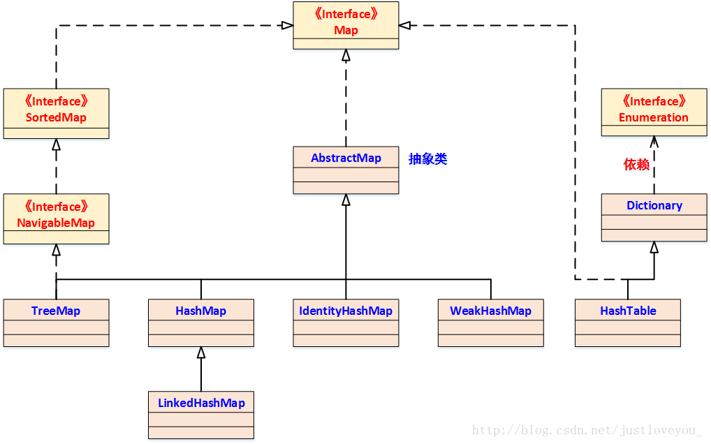

# 彻头彻尾理解 HashTable

#### 摘要：

Hashtable与HashMap都是Map族中较为常用的实现，也都是Java Collection Framework 的重要成员，它们的本质都是 链表数组。本文深入JDK源码并从定义、构造、结构、存取等四个方面深入解读了Hashtable的底层结构与存储逻辑，并阐述了HashMap、Hashtable与ConcurrentHashMap三者间的联系与区别。

## 一. Hashtable 概述

Hashtable和HashMap既是 Java Collection Framework 的重要成员，也是Map族(如下图所示)的核心成员，二者的底层实现都是一个 链表数组，具有寻址容易、插入和删除也容易的特性。事实上，HashMap几乎可以等价于Hashtable，除了HashMap是非线程安全的并且可以接受null键和null值。


## 二. Hashtable 在 JDK 中的定义

Hashtable实现了Map接口，并继承Dictionary抽象类 (已过时，新的实现应该实现 Map 接口而不是扩展此类)，其在JDK中的定义为：

```java
public class Hashtable<K,V>
    extends Dictionary<K,V>
    implements Map<K,V>, Cloneable, java.io.Serializable {

    /**
     * The hash table data.
     */
    private transient Entry[] table;   // 由Entry对象组成的链表数组

    /**
     * The total number of entries in the hash table.
     */
    private transient int count;   // Hashtable中Entry对象的个数

    /**
     * The table is rehashed when its size exceeds this threshold.  (The
     * value of this field is (int)(capacity * loadFactor).)
     *
     * @serial
     */
    private int threshold;   // Hashtable进行扩容的阈值

    /**
     * The load factor for the hashtable.
     *
     * @serial
     */
    private float loadFactor;   // 在其容量自动增加之前可以达到多满的一种尺度，默认为0.75

    /**
     * The number of times this Hashtable has been structurally modified
     * Structural modifications are those that change the number of entries in
     * the Hashtable or otherwise modify its internal structure (e.g.,
     * rehash).  This field is used to make iterators on Collection-views of
     * the Hashtable fail-fast.  (See ConcurrentModificationException).
     */
    private transient int modCount = 0;   // 记录Hashtable生命周期中结构性修改的次数
...
}
```

HashMap类似，Hashtable也包括五个成员变量，分别是table数组、Hashtable中Entry个数count、Hashtable的阈值threshold、Hashtable的负载因子loadFactor 和 Hashtable结构性修改次数modCount。下面分别给出这五个成员的具体内涵：

- Entry数组table： 一个由Entry对象组成的链表数组，table数组的每一个数组成员就是一个链表；
- Entry个数count： Hashtable中Entry对象的个数；
- 阈值threshold： Hashtable进行扩容的阈值；
- 负载因子loadFactor： 在其容量自动增加之前可以达到多满的一种尺度，默认为0.75；
- 构性修改次数modCount： 记录Hashtable生命周期中结构性修改的次数，便于快速失败(所谓快速失败是指其在并发环境中进行迭代操作时，若其他线程对其进行了结构性的修改，这时迭代器能够立马感知到并且立即抛出ConcurrentModificationException异常，而不是等到迭代完成之后才告诉你（你已经出错了）)；

## 三. Hashtable 的构造函数

Hashtable 一共提供了四个构造函数，其中默认无参的构造函数和参数为Map的构造函数为 Java Collection Framework 规范的推荐实现，其余两个构造函数则是Hashtable专门提供的。

### 1、Hashtable(int initialCapacity, float loadFactor)

该构造函数意在构造一个指定初始容量和指定负载因子的空 Hashtable，其源码如下：

```java
/**
     * Constructs a new, empty hashtable with the specified initial capacity and
     * the specified load factor.
     *
     * @param initialCapacity
     *            the initial capacity of the hashtable.
     * @param loadFactor
     *            the load factor of the hashtable.
     * @exception IllegalArgumentException
     *                if the initial capacity is less than zero, or if the load
     *                factor is nonpositive.
     */
    public Hashtable(int initialCapacity, float loadFactor) {
        if (initialCapacity < 0)
            throw new IllegalArgumentException("Illegal Capacity: "
                    + initialCapacity);
        if (loadFactor <= 0 || Float.isNaN(loadFactor))
            throw new IllegalArgumentException("Illegal Load: " + loadFactor);

        if (initialCapacity == 0)
            initialCapacity = 1;  // 初始容量完全由用户随意指定，不必是2的n次幂(不同于HashMap)
        this.loadFactor = loadFactor;  
        table = new Entry[initialCapacity];   // 创建指定大小为initialCapacity的链表数组
        threshold = (int) (initialCapacity * loadFactor);   // HashTable的扩容阈值
    }
```

###　2、Hashtable()

该构造函数意在构造一个具有默认初始容量(11)和默认负载因子(0.75f)的空 Hashtable，是 Java Collection Framework 规范推荐提供的，其源码如下：

```java
    /**
     * Constructs a new, empty hashtable with a default initial capacity (11)
     * and load factor (0.75).
     */
    public Hashtable() {
        this(11, 0.75f);   // 默认容量是11，不同于HashMap的默认初始容量16，默认负载因子0.75
    }
```

### 3、Hashtable(int initialCapacity)

该构造函数意在构造一个指定初始容量和默认负载因子(0.75f)的空Hashtable，其源码如下：

```java
    /**
     * Constructs a new, empty hashtable with the specified initial capacity and
     * default load factor (0.75).
     *
     * @param initialCapacity
     *            the initial capacity of the hashtable.
     * @exception IllegalArgumentException
     *                if the initial capacity is less than zero.
     */
    public Hashtable(int initialCapacity) {
        this(initialCapacity, 0.75f);    
    }
```

### 4、Hashtable(Map<? extends K, ? extends V> t)

该构造函数意在构造一个与指定 Map 具有相同映射的Hashtable，其初始容量不小于11(具体依赖于指定Map的大小)，负载因子是0.75f，是 Java Collection Framework 规范推荐提供的，其源码如下：
```java
    /**
     * Constructs a new hashtable with the same mappings as the given Map. The
     * hashtable is created with an initial capacity sufficient to hold the
     * mappings in the given Map and a default load factor (0.75).
     *
     * @param t
     *            the map whose mappings are to be placed in this map.
     * @throws NullPointerException
     *             if the specified map is null.
     * @since 1.2
     */
    public Hashtable(Map<? extends K, ? extends V> t) {
        this(Math.max(2 * t.size(), 11), 0.75f);
        putAll(t);
    }
```

与HashMap类似，构建一个Hashtable时也需要指定初始容量和负载因子这两个非常重要的参数，它们是影响Hashtable性能的关键因素。其中，容量表示哈希表中桶的数量(table 数组的大小)，初始容量是创建哈希表时桶的数量；负载因子是哈希表在其容量自动增加之前可以达到多满的一种尺度，它衡量的是一个散列表的空间的使用程度，负载因子越大表示散列表的装填程度越高，反之愈小。

对于Hashtable而言，查找一个元素的平均时间是O(1+a)(a 指的是链的长度，是一个常数)。特别地，负载因子越大，对空间的利用更充分，但查找效率的也就越低；若负载因子越小，那么哈希表的数据将越稀疏，对空间造成的浪费也就越严重。系统默认负载因子为0.75f，这是时间和空间成本上一种折衷，一般情况下我们是无需修改的。

## 四. Hashtable 的数据结构

我们知道，在Java中最常用的两种结构是数组和链表，其中，数组的特点是：寻址容易，插入和删除困难；而链表的特点是：寻址困难，插入和删除容易。Hashtable和HashMap综合了两者的特性，是一种寻址容易、插入和删除也容易的数据结构。实际上，Hashtable和HashMap本质上都是一个 链表数组，如下所示：


从上图中，我们可以形象地看出Hashtable底层实现还是数组，只是数组中存放的元素是Entry对象，而Entry对象是一种典型链状结构，定义如下：

```java
static class Entry<K,V> implements Map.Entry<K,V> {

    K key;     // 键值对的键
    V value;        // 键值对的值
    Entry<K,V> next;     // 指向下一个节点的指针
    int hash;     // key 的哈希值(与HashMap中key的哈希值计算方式不同)

    /**
     * Creates new entry.
     */
    protected Entry(int h, K k, V v, Entry<K,V> n) {     // Entry 的构造函数
        value = v;
        next = n;
        key = k;
        hash = h;
    }

    ......

}
```

Entry为Hashtable的内部类，实现了Map.Entry接口，是个典型的四元组，包含了键key、值value、指向下一个节点的指针next，以及Key的hash值四个属性。事实上，Entry是构成哈希表的基石，是哈希表所存储的元素的具体形式。

## 五. Hashtable 的快速存取

我们知道，在HashMap中，最常用的两个操作就是：put(Key,Value) 和 get(Key)。同样地，这两个操作也是Hashtable最常用的两个操作。下面我们结合JDK源码看Hashtable的存取实现。

### 1、Hashtable 的存储实现

在Hashtable中，键值对的存储是也是通过 put(key, vlaue) 方法来实现的，不同于HashMap的是，其put操作是线程安全的，源码如下：

```java
   /**
     * Maps the specified <code>key</code> to the specified <code>value</code>
     * in this hashtable. Neither the key nor the value can be <code>null</code>
     * .
     * <p>
     *
     * The value can be retrieved by calling the <code>get</code> method with a
     * key that is equal to the original key.
     *
     * @param key
     *            the hashtable key
     * @param value
     *            the value
     * @return the previous value of the specified key in this hashtable, or
     *         <code>null</code> if it did not have one
     * @exception NullPointerException
     *                if the key or value is <code>null</code>
     * @see Object#equals(Object)
     * @see #get(Object)
     */
    public synchronized V put(K key, V value) {     // 加锁同步，保证Hashtable的线程安全性
        // Make sure the value is not null
        if (value == null) {      // 不同于HashMap，Hashtable不允许空的value
            throw new NullPointerException();
        }

        // Makes sure the key is not already in the hashtable.
        Entry tab[] = table;
        int hash = key.hashCode();   // key 的哈希值，同时也暗示Hashtable不同于HashMap，其不允许空的key
        int index = (hash & 0x7FFFFFFF) % tab.length;   // 取余计算节点存放桶位，0x7FFFFFFF 是最大的int型数的二进制表示
        // 先查找Hashtable上述桶位中是否包含具有相同Key的K/V对
        for (Entry<K, V> e = tab[index]; e != null; e = e.next) {
            if ((e.hash == hash) && e.key.equals(key)) {
                V old = e.value;
                e.value = value;
                return old;
            }
        }

        // 向Hashtable中插入目标K/V对
        modCount++;     // 发生结构性改变，modCount加1
        if (count >= threshold) {    //在插入目标K/V对前，先检查是否需要扩容（不同于HashMap的插入后检查是否需要扩容） 
            // Rehash the table if the threshold is exceeded
            rehash();

            tab = table;
            index = (hash & 0x7FFFFFFF) % tab.length;   // 扩容后，重新计算K/V对插入的桶位
        }

        // Creates the new entry.
        Entry<K, V> e = tab[index];
        tab[index] = new Entry<K, V>(hash, key, value, e); // 将K/V对链入对应桶中链表，并成为头结点
        count++;     // Hashtable中Entry数目加1
        return null;
    }
```

通过上述源码我们可以看出，Hashtable与HashMap保存数据的过程基本相同：首先，计算key的hash值并确定K/V对要插入的桶位；其次，查找该桶位中是否存在具有相同的key的K/V对，若存在则覆盖直接对应的value值，否则将该节点(K/V)保存在桶中的链表的链头位置（最先保存的元素放在链尾）。当然，若该桶位是空的，则直接保存。特别地，在一些细节上，Hashtable与HashMap还是有一定的差别的：

- Hashtable不同于HashMap，前者既不允许key为null，也不允许value为null;
- HashMap中用于定位桶位的Key的hash的计算过程要比Hashtable复杂一点，没有Hashtable如此简单、直接；
- 在HashMap的插入K/V对的过程中，总是先插入后检查是否需要扩容；而Hashtable则是先检查是否需要扩容后插入；
- Hashtable不同于HashMap，前者的put操作是线程安全的。

### 2、Hashtable 的重哈希操作

重哈希过程主要是一个重新计算原Hashtable中的元素在新table数组中的位置并进行复制处理的过程，我们直接看其源码：

```java
   /**
     * Increases the capacity of and internally reorganizes this hashtable, in
     * order to accommodate and access its entries more efficiently. This method
     * is called automatically when the number of keys in the hashtable exceeds
     * this hashtable's capacity and load factor.
     */
    protected void rehash() {
        int oldCapacity = table.length;   // 先获取旧的Hashtable桶的数量，即容量
        Entry[] oldMap = table;

        int newCapacity = oldCapacity * 2 + 1;    // 扩容，扩到原始容量的2倍再加1
        Entry[] newMap = new Entry[newCapacity];   // 创建扩容后的新的链表数组

        modCount++;                // 重哈希操作是一个结构性改变操作，modCount加1
        threshold = (int) (newCapacity * loadFactor);   // 新的阈值   
        table = newMap;

        // 将原哈希表中的节点逐个复制到新的哈希表中
        for (int i = oldCapacity; i-- > 0;) {
            for (Entry<K, V> old = oldMap[i]; old != null;) {
                Entry<K, V> e = old;
                old = old.next;

                int index = (e.hash & 0x7FFFFFFF) % newCapacity;
                e.next = newMap[index];
                newMap[index] = e;
            }
        }
    }
```

特别需要注意的是，在重哈希的过程中，原属于同一个桶中的Entry对象可能会被分到不同的桶，因为Hashtable的容量发生了变化，那么(e.hash & 0x7FFFFFFF) % newCapacity的值也会发生相应的变化。退一步说，如果重哈希后原属于一个桶中的Entry对象仍属于同一桶，那么重哈希也就失去了意义。

### 3、Hashtable 的读取实现

相对于Hashtable的存储操作而言，读取就显得比较简单了。因为Hashtable只需通过key的hash值定位到table数组的某个特定的桶，然后查找并返回该key对应的value即可，源码如下：

```java
/**
     * Returns the value to which the specified key is mapped, or {@code null}
     * if this map contains no mapping for the key.
     *
     * <p>
     * More formally, if this map contains a mapping from a key {@code k} to a
     * value {@code v} such that {@code (key.equals(k))}, then this method
     * returns {@code v}; otherwise it returns {@code null}. (There can be at
     * most one such mapping.)
     *
     * @param key
     *            the key whose associated value is to be returned
     * @return the value to which the specified key is mapped, or {@code null}
     *         if this map contains no mapping for the key
     * @throws NullPointerException
     *             if the specified key is null
     * @see #put(Object, Object)
     */
    public synchronized V get(Object key) {    // 不同于HashMap，Hashtable的读取操作是同步的
        Entry tab[] = table;
        int hash = key.hashCode();   
        int index = (hash & 0x7FFFFFFF) % tab.length;   // 定位K/V对的桶位
        for (Entry<K, V> e = tab[index]; e != null; e = e.next) {   // 在特定桶中依次查找指定Key的K/V对
            if ((e.hash == hash) && e.key.equals(key)) {
                return e.value;       
            }
        }
        return null;   // 查找失败
    }
```

在这里能够根据key快速的取到value，除了和Hashtable的数据结构密不可分外，还和Entry有莫大的关系。在前面就已经提到过，Hashtable在存储过程中并没有将key，value分开来存储，而是当做一个整体Entry对象（四元组）来处理的。可以看到，在Entry对象中，value的地位要比key低一些，相当于是 key 的附属。在读取细节上，Hashtable与HashMap的主要差别如下：

- 不同于HashMap，Hashtable的读取操作是同步的；
- 在HashMap中，若读取到的Value值为NULL，则存在如下两种可能：该key对应的值就是null或者HashMap 中不存在该key；而在Hashtable中却只有一种可能：Hashtable中不存在含有该key的Entry。造成这种差别的原因正是二者对Key和Value的限制的不同：HashMap最多允许一个Key为null，但允许多个value值为null；Hashtable既不允许空的Key，也不允许空的Value。

## 六. HashMap、Hashtable 与ConcurrentHashMap的联系与区别

### 1、Hashtable与HashMap的联系与区别

1. HashMap和Hashtable的实现模板不同：虽然二者都实现了Map接口，但HashTable继承于Dictionary类，而HashMap是继承于AbstractMap。Dictionary是是任何可将键映射到相应值的类的抽象父类，而AbstractMap是基于Map接口的骨干实现，它以最大限度地减少实现此接口所需的工作。

2. HashMap和Hashtable对键值的限制不同：HashMap可以允许存在一个为null的key和任意个为null的value，但是HashTable中的key和value都不允许为null。

3. HashMap和Hashtable的线程安全性不同：Hashtable的方法是同步的，实现线程安全的Map；而HashMap的方法不是同步的，是Map的非线程安全实现。

4. HashMap和Hashtable的地位不同：在并发环境下，Hashtable虽然是线程安全的，但是我们一般不推荐使用它，因为有比它更高效、更好的选择ConcurrentHashMap；而单线程环境下，HashMap拥有比Hashtable更高的效率(Hashtable的操作都是同步的，导致效率低下)，所以更没必要选择它了。

### 2、Hashtable与ConcurrentHashMap的联系与区别

Hashtable和ConcurrentHashMap都可以用于并发环境，但是Hashtable的并发性能远不如ConcurrentHashMap，这种差异是由它们的底层实现决定的。在《彻头彻尾理解 ConcurrentHashMap》一文中，我们知道ConcurrentHashMap引入了分段锁机制，在默认理想状态下，ConcurrentHashMap可以支持16个线程执行并发写操作及任意数量线程的读操作；而Hashtable无论在读的过程中还是写的过程中都会锁定整个map，因此在并发效率上远不如ConcurrentHashMap。

此外，Hashtable和ConcurrentHashMap对键值的限制相同，二者的key和value都不允许是null。
